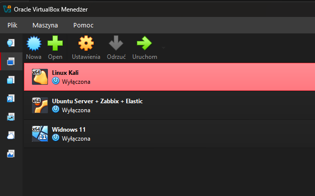

Do wykonania laboratorium potrzebne mi były 3 maszyny. Wszystkie zostały połączone w sieci wewnętrznej.

Każda VM ma dwa adaptery: 
- Adapter 1 = NAT
- Adapter 2 = Internal Network

(192.168.56.10) Ubuntu Server 26.04 - Serwer na którym postawiono Elastic Slack, Kibane, Fleet Server i Zabbixa.
(192.168.56.11) Windows 11 - Ofiara ataku
(192.168.56.12) Linux Kali  - Maszyna z której przeprowadzono atak


2.2 Sieć wirtualna

Każdej maszynie przypisano statyczne IP.


- Ubuntu: '192.168.56.10' (netplan):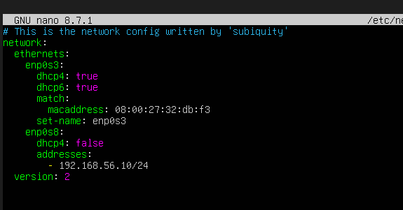
  

**UWAGA: Należy w sieci NAT dodać porty pod maszynę która jest serwerem! Bez nich laboratorium nie zadziała.**

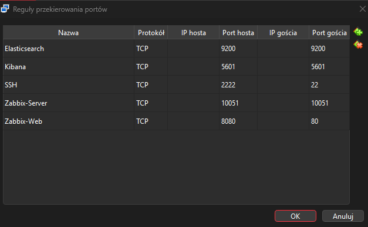

- Windows '192.168.56.11' (ręcznie): 

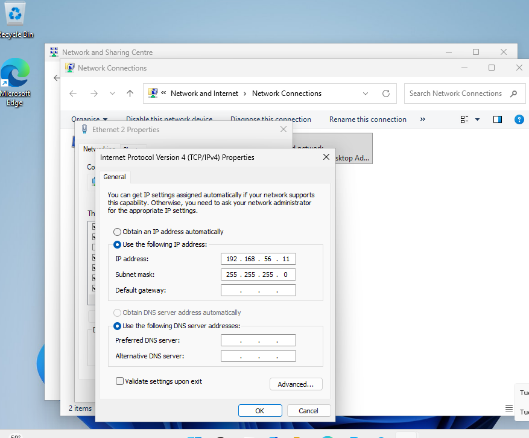

- Kali '192.168.56.12':

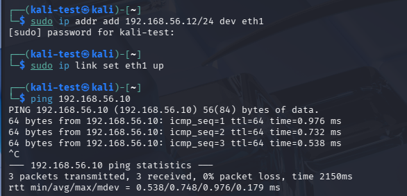


Pomiędzy każdą maszyną sprawdzono, czy jest łączność. Użyłem komendy `ping`.

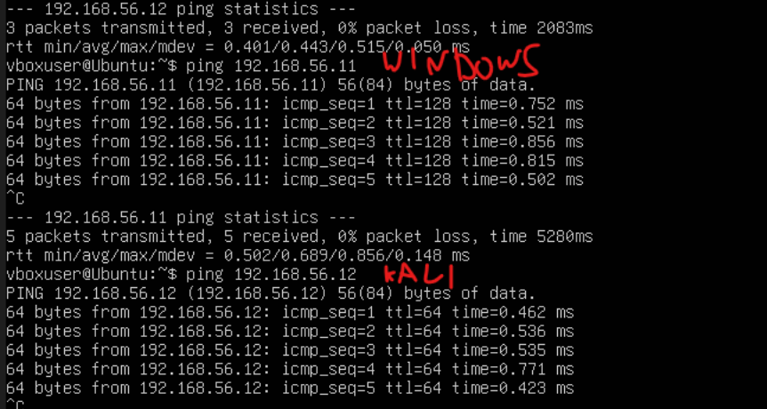

**UWAGA: W następnych krokach trzeba zapisać hasło i token w bezpiecznym miejscu przy pierwszym uruchomieniu!**

2.3 Elastic Stack
Wersja: 9.5.2
Plik konfiguracyjny `config/elasticsearch.yml`
- Zmieniono na adres 0.0.0.0, żeby uprościć widoczność Elastica,
- xpack.security.enabled: true

2.4 Kibana
Wersja: 9.5.2
Plik konfiguracyjny: `config/kibana.yml`
- Klucze szyfrujące zostały wygenerowane przez: `bin/kibana-encryption-keys generate`
- Zmodyfikowano plik kibana.yml poprzez dodanie kluczy szyfrujących:

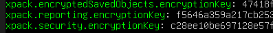

Tak wygląda poprawne pierwsze uruchomienie Kibany:

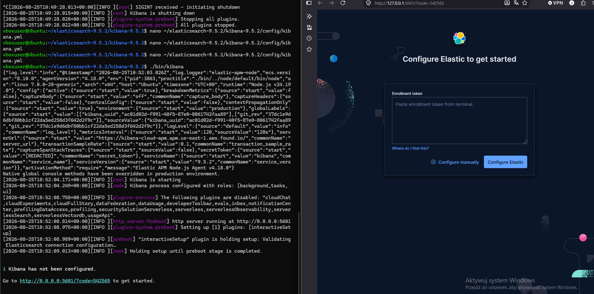

Należy wpisać klucz i token wygenerowany na początku pierwszego uruchomienia Elastic Search.


2.5 Fleet Server

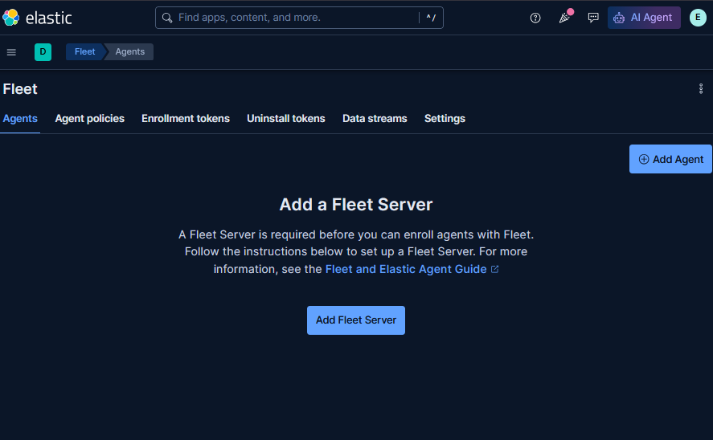

W tym panelu można dodawać agentów i Fleet Server. Jest on potrzebny żeby utworzyć łączność między Windowsem a Ubuntu w celu zbierania logów.

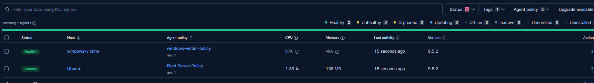


2.6 Windows Elastic Agent

Elastic sam w sobie podaje już komendy do instalowania agentów. Generuje link na podstawie podanych mu wartości w tym adresu IP i tokenów:

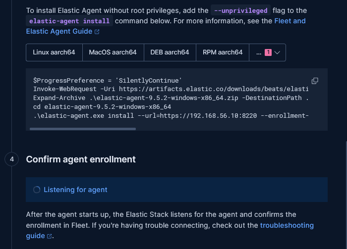

Jego instalacja trwa mniej więcej do 15 sekund.

2.7 Zabbix

Instalacja przebiegła zgonie z:
https://www.zabbix.com/download?zabbix=7.4&os_distribution=ubuntu&os_version=26.04&components=server_frontend_agent&db=mysql&ws=apache
*Użyto biblioteki MariaDB.

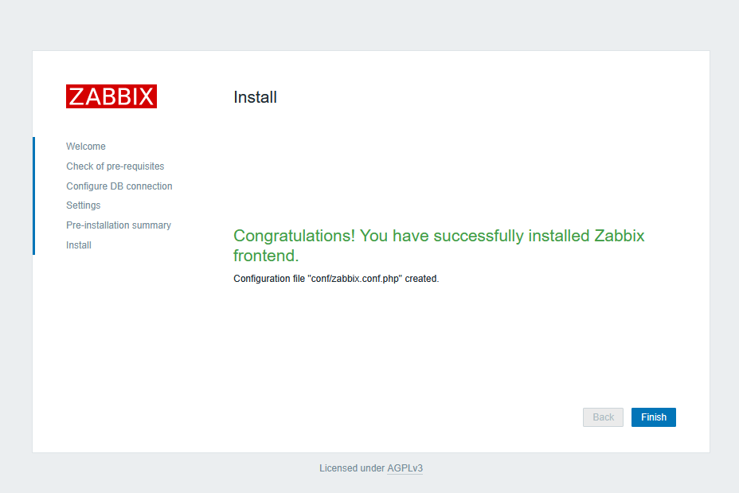

2.8 Zabbix Agent Windows

Na Windowsie lepiej użyć Agent 2, ponieważ jest bardziej nowoczesna. 

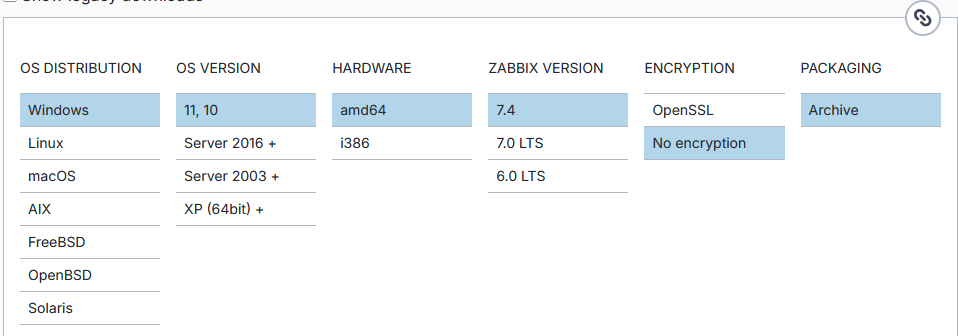


W pliku konfiguracyjnym należy wypełnić **3 najważniejsze wartości:**

- *Hostname,*

**UWAGA: Nazwa musi być taka sama jak w panelu Admina podczas dodawania agenta!**

- *Server,*
- *ServerActive*

Dwie ostatnie wartości wypełnia się adresem IP, gdzie postawiono serwer. W moim przypadku jest to 192.168.56.10 (Ubuntu Server).


2.9 Konfiguracja reguły do wykrywania Brute Force:

W pliku konfiguracyjnym zabbix_agent2.conf należy dodać na samym końcu:

```
UserParameter=bruteforce.count,powershell.exe -NoProfile -ExecutionPolicy Bypass -Command "(Get-WinEvent -FilterHashtable @{LogName='Security'; Id=4625; StartTime=(Get-Date).AddMinutes(-5)} -ErrorAction SilentlyContinue | Measure-Object).Count"
```

Polecam w terminalu potwierdzić, czy komenda działa:

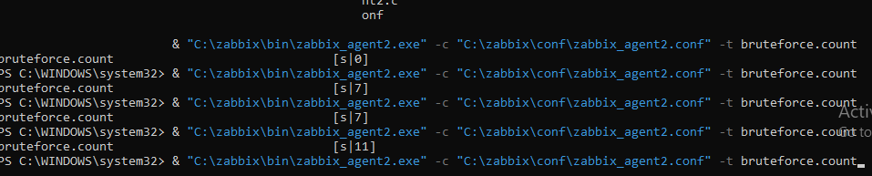

Komenda ta sprawdza, ile jest wykrytych nieprawidłowych logowań. Jeśli zlicza w Powershell, to działa poprawnie.

Przechodzimy do panelu Zabbixa:

1. Data Collection -> Hosts -> (nazwa agenta) Items -> Create Item (prawy górny róg)

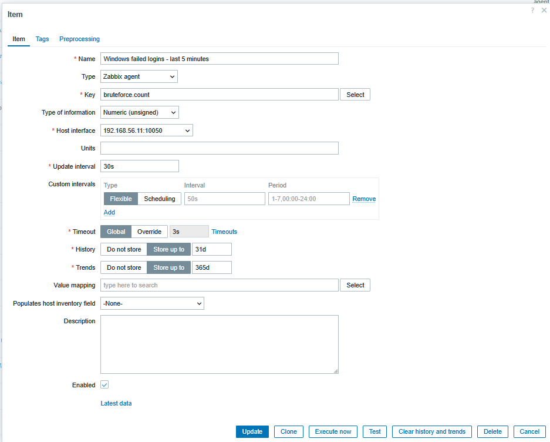


2. Monitoring -> Problems -> (Nazwa agenta) Triggers -> Create trigger (Prawy górny róg)

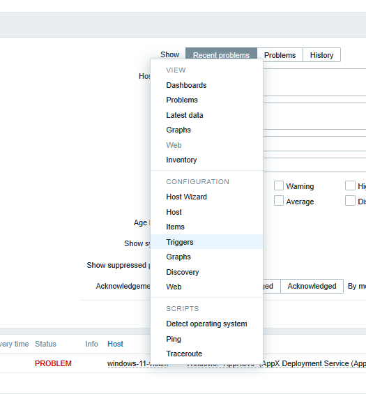

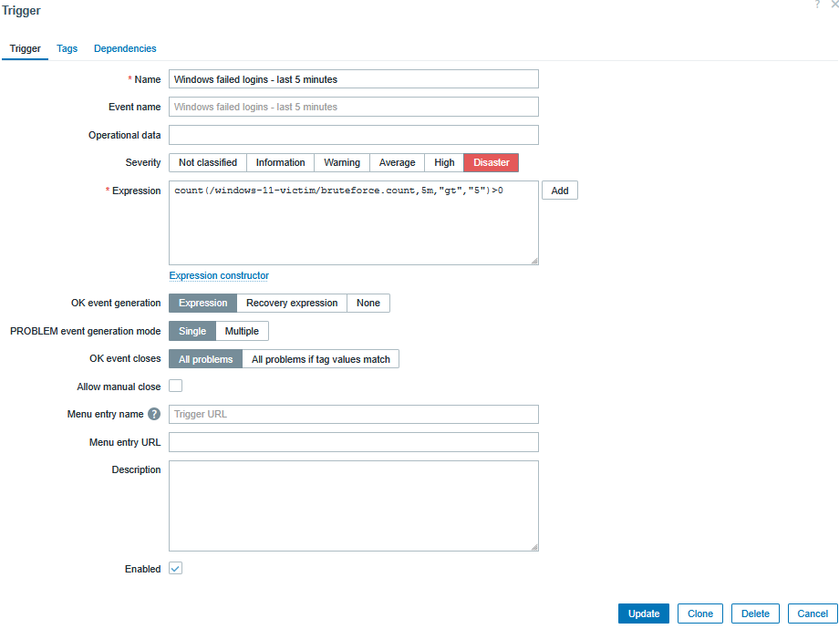

```
count(/windows-11-victim/bruteforce.count,5m,"gt","5")>0
```

Jeżeli jest więcej niż 5 błędnych zalogowań poniżej 5 minut, to problem uruchamia się jako krytyczny.
