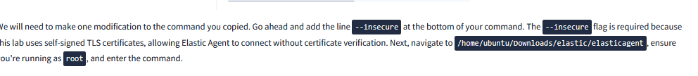

1. Problem z biblioteka MySql

![[Pasted image 20260731230732.png]](../images/18-blad.png)

Oryginalna biblioteka MySql z jakiegoś powodu nie chciała się włączyć. Alernatywą do niej jest MariaDb która bez problemu zastepuje oryginalne MySql.

![[Pasted image 20260731231421.png]](../images/19-blad.png)

2. **Status `inactive (dead)` usługi Zabbix:** brak ustawionej opcji automatycznego startu (`systemctl enable`) po reboocie serwera.

3. System po dłuższej chwili nieaktywności nie wyświetlał się w dashboardzie.
Wyświetliłem katalog /var/log/zabbix/zabbix_server.log i oto wyniki jakie wyszły:

![[Pasted image 20260806222647.png]](../images/20-blad.png)

Problemem także było inne hasło ustawione w pliku konfiguracyjnym i MySQL. Po zmianie na ten sam i restarcie wszystko wróciło do normy.

4. Agent nie chciał się połączyć - Windows
Na początku próbowałem wyłączyć tymczasowo firewalla. Natomiast na dłuższy czas nie było by to bezpieczne.
Rozwiązanie: przy dodawaniu hosta przy najnowszych wersjach Zabbixa w dashboardzie, trzeba obowiązkowo dodać zakładkę Zabbix Agent by Windows. Wtedy wszystko poprawnie się uruchamia.

5. Co zrobić gdy Elastic jest otwarty w jednym oknie?

![[Pasted image 20260825125424.png]](../images/21-blad.png)

Miałem dostępne tylko jedno okno terminala. Nie mogłem nic edytować po odpaleniu Elastica. Musiałem zainstalować pakiet SSH, za którego pomocą połączyłem się z Windowsa po lokalnym hoście. W ten sposób gdy jedno okno jest zajęte w wirtualnej maszynie, to mogłem nadal korzystać z Ubuntu Server z terminala hosta na Windowsie 11.

6. Błąd zabezpieczenia 

Należy wygenerować klucze szyfrujące, żeby dodać Fleet Server, czyli usługę która pozwala monitorować logi z wielu urządzeń.

![[Pasted image 20260825135530.png]](../images/22-blad.png)

./bin/kibana-encryption-keys generate
Później należy te klucze dodać na końcu pliku konfiguracyjnego kibany.

7. Windows nie odbierał pingów.

Problemem był firewall który blokował odbieranie pingów. Należało dodać regułę która odpowiadała za odbieranie na adres icmpv4:

![[Pasted image 20260825145300.png]](../images/23-blad.png)

8. Problem podczas instalacji agenta.
Podczas instalacji nie dodałem opcji --insecure

![[Pasted image 20260825173940.png]](../images/24-blad.png)

Źródło: TryHackMe

9. Przeciążenie 
Z powodu braku domyślnego ograniczenia Elastica i Kibany, zużywają całą pamięć RAM doprowadzając do crashowania Zabbixa. Należy ograniczyć zużycie:

`nano ~/elasticsearch-9.5.2/config/jvm.options.d/heap.options` ->

-Xms2g
-Xmx2g

*(Xms - Minimum heap size,*
*Xmx - Maximum heap size,*
*2g - 2GB pamięci)*

W ten sposób pamięć jest ograniczona do maks 2GB.

